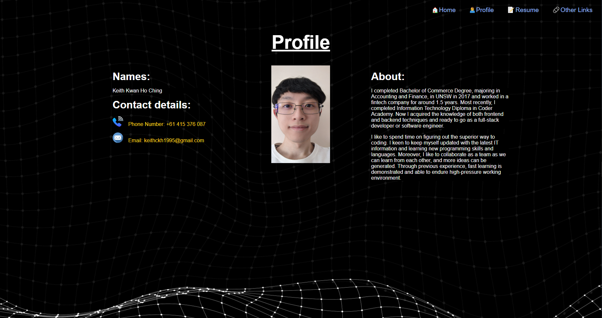
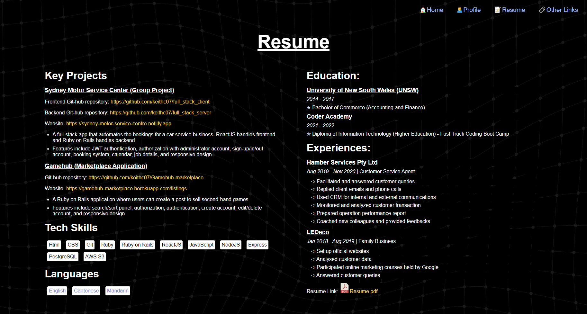

* URL to my portfolio website: [https://keith-ching-eportfolio.netlify.app/index.html]()

* GitHub repo: [https://github.com/keithc07/ePortfolio.git]()

* Description of my portfolio website:

  * Purpose: acts as an electronic portfolio where viewers can understand more about me. In the meantime, it will also provide personal information that is in relation to job recruitment
  
  * Functionality / features: the website will be mainly in black and white tone where it shows a great contrast. Viewers are easier to read the text. There are multiple hyperlinks where viewers are able to access my documents and other websites or get in-touch with me via phone or email. Also, the website has a responsive design where viewers can access the website smoothly with different devices.

  * Sitemap:
  
    
    
  * Screenshots:
  
    
  
    
  
    
  
    
  
  * Target audience: HR or employee of IT and FinTech company
  
  * Tech stack:
  
    * coding with HTML and CSS
    * deployment platform: Netlify
